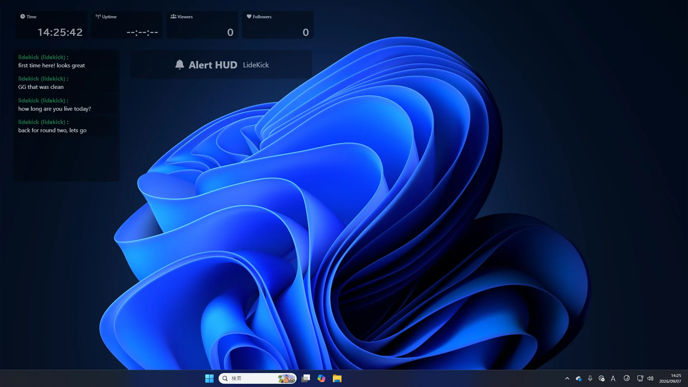

**English** | [日本語](README.ja.md)

# LideKick

**Your live streaming sidekick.** LideKick shows your Twitch viewer count, followers, chat, and alerts as a HUD on your own screen — over your game, your browser, or whatever else you have open. Especially handy on a single-monitor setup.

> [!IMPORTANT]
> **LideKick is not a stream overlay.** It is for you, the streamer, so you don't have to alt-tab or keep glancing at a second monitor to see what's happening in your chat.

> [!NOTE]
> **English is available from v1.4.2.** The app follows your system language on first launch, and you can switch between English and Japanese in the app settings at any time. The website is in English too.

## Features

- **Status HUD** — clock, uptime, viewer count, follower count, and subscriber count
- **Chat HUD** — a live chat log, with an optional sound when a new message arrives
- **Alerts** — follows, subscriptions, gift subs, bits, raids, and whispers
- **Dashboard** — a separate window with widgets: viewer and follower counts, uptime, chat, alerts, an OBS audio level meter, and clocks
- **OBS integration** — connects over OBS WebSocket

## Download

**Free.** If you like it, you can [support me on Ko-fi](https://ko-fi.com/N3H822E5DU).

**[Download from the website](https://www.lidekick.app/)** — this is the recommended way, and always has the latest version.

Builds are also attached to the [Releases](../../releases) here, starting from v1.4.1.

## Requirements

- **Windows** 10 or later (x64)
- **macOS** on Apple Silicon — **Intel Macs are not supported**
- A Twitch account

## Installation notes

LideKick is **not code-signed**, so your OS will warn you the first time you run it.

- **Windows** — SmartScreen shows "Windows protected your PC". Click *More info* → *Run anyway*.
- **macOS** — Gatekeeper says the developer cannot be verified.
  1. Try to open the app once and dismiss the warning.
  2. Open **System Settings → Privacy & Security**, scroll down, and click **Open Anyway** (you may need your admin password).
  3. On older versions of macOS, right-clicking the app and choosing *Open* also works.

  The **Open Anyway** button disappears about an hour after the failed launch, so if you don't see it, try launching the app again first.

## Updates

| | |
|---|---|
| **Windows** | Downloads and installs from inside the app |
| **macOS** | Opens the download page in your browser |

In-app updates on macOS require code signing. Without it the install step fails *after* the download has already finished, so LideKick sends you to the download page from the start instead.

## Feedback

Issues are disabled on this repository. LideKick is a solo side project, and an open issue tracker isn't something I can keep up with.

**Please use the in-app feedback form instead** — *フィードバック* (Feedback) in the sidebar. It reaches me directly, and bug reports are genuinely appreciated.

## Links

- [Website](https://www.lidekick.app/)

---

© Busho Higeo. LideKick is closed-source — this repository hosts releases and documentation only.
